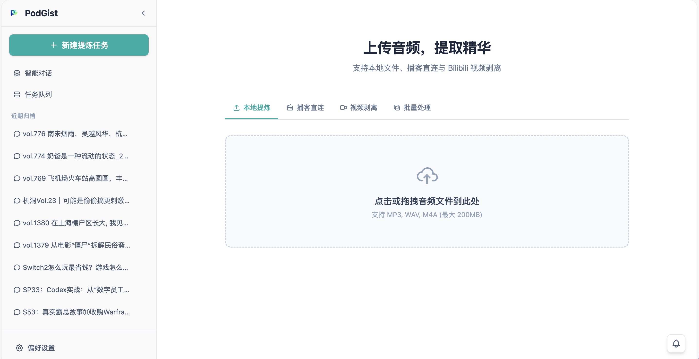

# PodGist

> 本地算力驱动的 AI 音频提炼工具 | 让音频内容可搜索、可定位、可复用

[](https://opensource.org/licenses/MIT)


[](https://github.com/TobyKSKGD/PodGist/releases)

## 软件截图



## 简介

**PodGist** 是一个基于本地算力与 AI 技术的音频内容结构化工具。它通过语音转录和大语言模型分析，将各类音频（播客、讲座，会议录音等）转化为带精确时间轴的结构化摘要，解决音频内容难以快速定位、检索和预览的核心痛点。

> **注**：PodGist 最初为播客总结而设计，现已不局限于播客，可以提炼所有类型的音频。

---

## 安装与使用

> **面向用户** — 下载安装包即可使用，无需配置开发环境。

### macOS 版本

#### 系统要求

- macOS 11.0 (Big Sur) 或更高版本
- Apple Silicon (M1/M2/M3/M4) 或 Intel 芯片
- 推荐 8GB 以上内存

#### 安装步骤

**1. 下载安装包**

点击 [PodGist v1.0.0 macOS 安装包](https://github.com/TobyKSKGD/PodGist/releases) 下载 `.dmg` 文件。

**2. 安装应用**

```
打开下载的 .dmg 文件
将 PodGist.app 拖入 Applications（应用程序）文件夹
```

**3. 启动应用**

```
在 Launchpad 或 Applications 文件夹中双击 PodGist
首次启动时若提示"无法打开"，
请前往 系统偏好设置 → 安全性与隐私 → 通用
点击"仍要打开"
```

**4. 配置 API Key**

应用启动后，右侧边栏底部点击**偏好设置**，输入你的 DeepSeek API Key 并保存。

> 没有 DeepSeek API Key？访问 [DeepSeek 开放平台](https://platform.deepseek.com/) 注册获取。

**5. 开始使用**

- **本地文件**：点击上传区域或拖拽 MP3、WAV、M4A 等音频文件
- **播客链接**：粘贴小宇宙、Apple Podcasts、喜马拉雅等平台链接
- **B站视频**：粘贴 Bilibili 视频链接
- **智能对话**：向全部历史归档提问，基于 RAG 技术精准定位相关内容

#### Windows 版本

> 暂无，Windows 打包开发中。

#### 功能概览

| 功能 | 状态 |
|------|------|
| 本地音频文件转录摘要 | ✅ 已支持 |
| 播客链接解析（小宇宙/Apple/喜马拉雅/网易云） | ✅ 已支持 |
| B站视频音频提取 | ✅ 已支持 |
| SenseVoice 极速转录引擎 | ✅ 已支持 |
| Whisper 高精度转录引擎 | ✅ 已支持 |
| DeepSeek LLM 摘要生成 | ✅ 已支持 |
| 智能对话与 RAG 语义搜索 | ✅ 已支持 |
| 标签管理与归档整理 | ✅ 已支持 |
| 批量处理 | ✅ 已支持 |
| Windows 安装包 | 🔨 开发中 |

---

## 快速开始

> **面向开发人员** — 本地搭建开发环境。

### 前置要求

- **Python 3.10+**
- **Node.js 18+**（含 npm）
- **FFmpeg**（系统级依赖，Whisper/SenseVoice 需要其进行音频解码）
- 支持的计算硬件：
  - Apple Silicon（MPS 加速，macOS）
  - NVIDIA GPU（CUDA 加速，Windows/Linux）
  - 或普通 CPU（速度较慢）

---

### 安装步骤（所有平台通用）

#### 1. 克隆并进入项目目录

```bash
git clone https://github.com/TobyKSKGD/PodGist.git
cd PodGist
```

#### 2. 创建 Python 虚拟环境

**macOS / Linux:**
```bash
python3 -m venv env
source env/bin/activate
```

**Windows (PowerShell / CMD):**
```powershell
# PowerShell 或 CMD 均可
python -m venv env
env\Scripts\activate
```

#### 3. 安装 PyTorch（根据你的硬件选择）

**macOS Apple Silicon (M1/M2/M3):**
```bash
pip install torch torchvision torchaudio
```

**Windows / Linux NVIDIA GPU (CUDA 12.4):**
```bash
pip install torch torchvision torchaudio --index-url https://download.pytorch.org/whl/cu126
```

**仅 CPU 运行（所有平台）:**
```bash
pip install torch torchvision torchaudio --index-url https://download.pytorch.org/whl/cpu
```

> 若不确定显卡型号或 CUDA 版本，请先运行 `nvidia-smi` 查看。安装遇到问题参考 [PyTorch 官方指南](https://pytorch.org/get-started/locally/)。

#### 4. 安装 FFmpeg

**macOS:**
```bash
brew install ffmpeg
```

**Windows (PowerShell):**
```powershell
# 方式一：winget（推荐）
winget install ffmpeg

# 方式二：手动下载
# 从 https://ffmpeg.org/download.html 下载 Windows builds
# 解压后将 bin/ffmpeg.exe 加入系统 PATH
```

**Linux (Ubuntu/Debian):**
```bash
sudo apt update && sudo apt install ffmpeg
```

> 安装完成后运行 `ffmpeg -version` 确认。

#### 5. 安装 Python 依赖

```bash
pip install -r requirements.txt
```

#### 6. 安装前端依赖

```bash
cd frontend
npm install
cd ..
```

---

### 启动应用

#### 一键启动（推荐）

```bash
npm run dev
```

> `npm run dev` 会自动检测操作系统，清理端口 8000/5173 的旧进程，并同时启动后端和前端。

- **后端**: `http://localhost:8000`
- **前端**: `http://localhost:5173`

#### 分步启动（调试用）

```bash
# 终端 1：后端
source env/bin/activate   # Windows: env\Scripts\activate
uvicorn api:app --reload --port 8000 --app-dir .

# 终端 2：前端
cd frontend
npm run dev
```

---

### 配置说明

首次使用需配置 **DeepSeek API Key**：

1. 打开应用，右侧边栏底部点击「偏好设置」
2. 输入你的 DeepSeek API Key 并保存

API Key 存储在本地 `.env` 文件中，不会提交到版本控制。

---

### 常见问题

**Q: SenseVoice 检测失败？**
确保已安装 `modelscope` 和 `pydub`，以及系统 FFmpeg 已正确配置到 PATH。

**Q: Windows 上 `npm run dev` 报错？**
确保已安装 Node.js 18+，并使用 PowerShell 或 CMD 运行（非 WSL 子系统内部）。

**Q: 端口被占用？**
运行 `npm run dev` 前会先自动清理旧进程，也可手动：
```powershell
# Windows
netstat -ano | findstr :8000
taskkill /PID <PID> /F
```

**Q: 归档向量索引失败？**
运行 `POST http://localhost:8000/api/chat/index-all` 手动触发存量归档索引。

---

## 技术架构

PodGist v1.0.0 采用 **React + FastAPI** 分离架构：

```
┌─────────────────────────────────────────────────────┐
│                  React Frontend                     │
│              (http://localhost:5173)               │
│         Tabler Icons · Tailwind CSS v4              │
└──────────────────────┬──────────────────────────────┘
                       │ HTTP / REST
                       ▼
┌─────────────────────────────────────────────────────┐
│                 FastAPI Backend                     │
│               (http://localhost:8000)              │
│     Whisper · SenseVoice · DeepSeek · yt-dlp       │
└─────────────────────────────────────────────────────┘
```

### 前端 (`frontend/`)

- **React 19** + **TypeScript** + **Vite** — 极速开发体验
- **Tailwind CSS v4** — 原子化样式方案
- **Tabler Icons** — 简洁轮廓图标库
- **Axios** — HTTP 客户端

### 后端 (`api.py` + `backend/`)

| 模块 | 功能 |
|------|------|
| `api.py` | FastAPI 主服务，RESTful 接口，CORS 跨域支持 |
| `backend/transcriber.py` | Whisper/SenseVoice 转录与硬件检测 |
| `backend/llm_agent.py` | DeepSeek LLM API 封装与摘要生成 |
| `backend/rag_db.py` | SQLite 表 + ChromaDB 向量库（RAG 存储） |
| `backend/rag_retriever.py` | RAG 检索管道与流式生成 |
| `backend/downloader.py` | 多平台在线音频解析与下载 |
| `backend/worker.py` | 后台任务处理与队列管理 |
| `backend/task_queue.py` | SQLite 任务队列状态管理 |
| `backend/diagnostics.py` | 系统诊断与组件检测 |

---

## 核心功能

- **双引擎转录**：支持 SenseVoice（极速）和 Whisper（高精度）两种转录引擎
- **SenseVoice 极速模式**：基于阿里开源 FunAudioLLM/SenseVoiceSmall，极速转录（比 Whisper 快 10 倍以上），支持中文、英文、粤语等 50+ 语言
- **精确时间轴**：生成带 `[MM:SS]` 或 `[HH:MM:SS]` 格式时间戳的逐字稿，实现音频内容到文本位置的精确映射
- **结构化摘要生成**：通过大语言模型提取节目短标题、核心关键词、详细概述和密集高光时间轴
- **语义搜索与定位**：基于 RAG 技术实现自然语言查询，直接向全部历史音频归档提问并精确定位相关时间段
- **智能对话与标签管理**：与音频知识库对话，按标签筛选归档范围，双向溯源引用记录
- **自动化归档**：处理完成后自动清理临时文件，将原始文本和结构化摘要以 Markdown 格式持久化保存
- **多平台音频提取**：支持直接输入多个平台的播客/视频链接，自动提取音频并生成摘要
- **批量处理**：支持批量上传多个音频文件，排队依次处理

---

## 支持的平台

### 播客平台

| 平台 | 说明 |
|------|------|
| 小宇宙 | 自动解析 MP3 直链 |
| 喜马拉雅 | 自动解析并下载音频 |
| Apple Podcasts | 自动提取音频 |
| 网易云音乐 | 支持播客单集链接 |

### 视频平台

| 平台 | 说明 |
|------|------|
| Bilibili | 提取视频音频，支持大会员（需配置 cookies） |

---

## 使用流程

1. 启动应用：`npm run dev`（开发者模式）或双击 PodGist.app（安装用户）
2. 在设置中输入 DeepSeek API Key 并保存
3. 选择输入方式：
   - **本地文件**：上传 MP3、WAV、M4A 等音频文件（支持拖拽）
   - **播客直连**：粘贴小宇宙、喜马拉雅、Apple Podcasts、网易云音乐等平台链接
   - **B站视频**：粘贴 Bilibili 视频链接
   - **批量处理**：粘贴多个链接或本地音频路径，每行一个
4. 选择转录引擎（SenseVoice 极速模式或 Whisper 高精度模式）
5. 等待转录和摘要生成完成
6. 查看生成的节目摘要、核心关键词和详细时间轴
7. **智能对话**：与全部历史归档进行自然语言对话，支持按标签或指定归档筛选范围
8. 为归档打标签整理，知识库越用越精准
9. 通过 AI 模糊定位器输入自然语言问题，精确定位相关内容时间段
10. 下载完整 Markdown 报告或查看历史归档

---

## 项目结构

```
PodGist/
├── api.py                      # FastAPI 主程序（后端服务入口）
├── start.js                    # 跨平台一键启动脚本（自动检测 OS）
├── backend/
│   ├── __init__.py
│   ├── transcriber.py          # Whisper/SenseVoice 转录与硬件检测
│   ├── llm_agent.py            # LLM API 封装与摘要生成
│   ├── rag_db.py               # SQLite 表 + ChromaDB 向量库（RAG）
│   ├── rag_retriever.py        # RAG 检索管道与流式生成
│   ├── downloader.py           # 多平台在线音频解析与下载
│   ├── worker.py               # 后台任务处理
│   ├── task_queue.py           # 任务队列状态管理
│   └── diagnostics.py          # 系统诊断
├── frontend/                    # React + Vite 前端
│   ├── src/
│   │   ├── App.tsx             # 主应用组件
│   │   ├── components/         # UI 组件
│   │   │   ├── ChatView.tsx   # 智能对话组件（RAG）
│   │   │   ├── TagManager.tsx # 标签管理组件
│   │   │   └── ...
│   │   └── index.css           # Tailwind CSS 入口
│   ├── public/                 # 静态资源
│   ├── package.json
│   └── vite.config.ts
├── archives/                    # 生成的 Markdown 归档目录（用户数据）
├── temp_audio/                  # 临时音频 + SQLite + ChromaDB（用户数据）
├── assets/                      # 静态资源（Logo、Favicon）
├── config.json                  # 应用配置（引擎、设备等）
├── .env                         # API Key 本地存储（不提交）
├── requirements.txt             # Python 依赖清单
└── README.md
```

---

## 更新日志

所有重要变更都会记录在 [CHANGELOG.md](CHANGELOG.md) 中。

### v1.0.0（2026-04-03）

**首发版本 - macOS Lite**

| 类型 | 描述 |
|------|------|
| ✨ 新增 | macOS 桌面应用（Electron + DMG 安装包） |
| ✨ 新增 | 全局启动拦截与健康检查（后端就绪前显示加载动画） |
| ✨ 新增 | API Key 配置持久化（Electron 环境下正确读写用户数据目录） |
| ✨ 新增 | SenseVoice 极速转录引擎（比 Whisper 快 10 倍以上） |
| ✨ 新增 | 双引擎支持（SenseVoice + Whisper） |
| ✨ 新增 | 多平台播客链接解析（小宇宙/Apple Podcasts/喜马拉雅/网易云） |
| ✨ 新增 | B站视频音频提取与转录摘要 |
| ✨ 新增 | 智能对话（RAG 语义搜索，流式 SSE 响应） |
| ✨ 新增 | 标签管理与归档整理 |
| ✨ 新增 | 批量处理（多文件/多链接排队处理） |
| 🐞 修复 | Worker 任务处理路径问题（`PODGIST_DATA_DIR` 环境变量） |
| 🐞 修复 | API Key 读取路径问题（uvicorn 重导入导致 CLI 参数丢失） |
| 🐞 修复 | SSE 流式解析 TCP chunk 边界截断问题（`eventData` 状态提升） |
| 🐞 修复 | pydub ffprobe/ffmpeg 路径未设置问题 |
| 🐞 修复 | Electron 打包后 yt-dlp/ffprobe 找不到的问题 |
| 🔧 优化 | 前端加载动画（替代 DinoLoader 小恐龙） |
| 🔧 优化 | Electron 后端启动流程（venv PATH 自动配置） |

---

## 未来规划

- [ ] **Windows 安装包**：提供 Windows 版可执行安装包
- [ ] **多模型支持**：扩展支持更多大语言模型 API
- [ ] **处理流程优化**：引入异步任务队列和进度中断功能
- [x] **跨音频语义搜索（RAG）**：在全部历史归档中实现全局语义搜索（已完成）
- [ ] **导出格式扩展**：支持导出为 JSON、PDF、Notion 等多种格式

---

## 依赖

### 前端

- [React](https://react.dev/) - UI 框架
- [Vite](https://vitejs.dev/) - 构建工具
- [Tailwind CSS](https://tailwindcss.com/) - 样式框架
- [Tabler Icons](https://tabler-icons.io/) - 图标库
- [Axios](https://axios-http.com/) - HTTP 客户端

### 后端

- [FastAPI](https://fastapi.tiangolo.com/) - Web 框架
- [OpenAI Whisper](https://github.com/openai/whisper) - 语音识别
- [ModelScope / SenseVoice](https://www.modelscope.cn/models/iic/SenseVoiceSmall) - 极速语音识别
- [DeepSeek API](https://platform.deepseek.com/) - 大语言模型
- [PyTorch](https://pytorch.org/) - 深度学习框架
- [yt-dlp](https://github.com/yt-dlp/yt-dlp) - 音视频下载
- [ChromaDB](https://www.trychroma.com/) - 本地向量数据库（RAG）
- [Sentence Transformers](https://www.sbert.net/) - 文本向量化（RAG）

---

## 许可证

MIT License
